# Deep Tree Echo Self - Comprehensive Technical Architecture

## Executive Summary

The Deep Tree Echo Self is a sophisticated cognitive architecture implementing a computational framework for wisdom cultivation through relevance realization optimization. The system integrates six core computational paradigms into a unified emergent architecture:

1. **Paun P-System Membrane Reservoirs** - Hierarchical multi-scale filtering
2. **Deep Tree Echo State Networks** - Reservoir computing with memory
3. **Butcher B-Series Integration** - Temporal differential dynamics
4. **J-Surface Differential Geometry** - Trajectory optimization
5. **Differential Emotion Theory** - Affective agency integration
6. **GPT Transformer Attention** - Relevance realization computation

**Technology Stack**: Julia 1.9+, ModelingToolkit, DifferentialEquations, Symbolics, Graphs, PyCall

**Philosophical Foundation**: John Vervaeke's cognitive science framework (4E Cognition, Four Ways of Knowing, Relevance Realization)

---

## 1. System Architecture Overview

### 1.1 High-Level Component Diagram

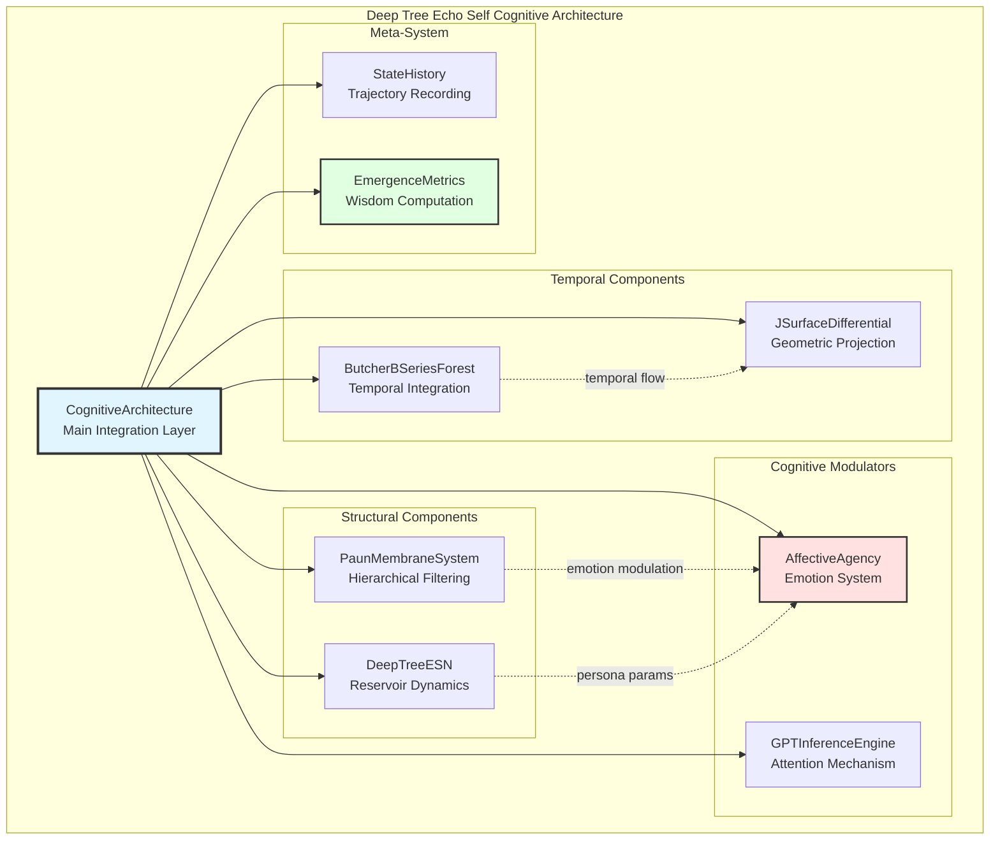

### 1.2 Information Flow Architecture

```mermaid
flowchart LR
    Input[Input Vector<br/>Float64] --> Emotions[Emotion Triggering]
    Emotions --> EmotionUpdate[Update Emotion<br/>Dynamics]
    EmotionUpdate --> Modulation[Compute Cognitive<br/>Modulation]
    
    Modulation --> Membranes[Membrane System<br/>Hierarchical Filtering]
    Membranes --> ESN[Tree ESN<br/>Reservoir Processing]
    ESN --> BSeries[B-Series<br/>Temporal Integration]
    BSeries --> JSurf[J-Surface<br/>Geometric Projection]
    JSurf --> GPTCheck{GPT<br/>Available?}
    
    GPTCheck -->|Yes| GPTProc[GPT Attention<br/>Relevance Computation]
    GPTCheck -->|No| Output[Output Vector<br/>Float64]
    GPTProc --> Integration[Integrate with<br/>Reservoir]
    Integration --> Output
    
    Output --> Record[Record State<br/>to History]
    Record --> Emergence[Compute Emergence<br/>Metrics]
    
    style Input fill:#e1f5ff
    style Output fill:#e1ffe1
    style Emotions fill:#ffe1e1
    style Emergence fill:#fff4e1
```

### 1.3 Hierarchical Processing Structure

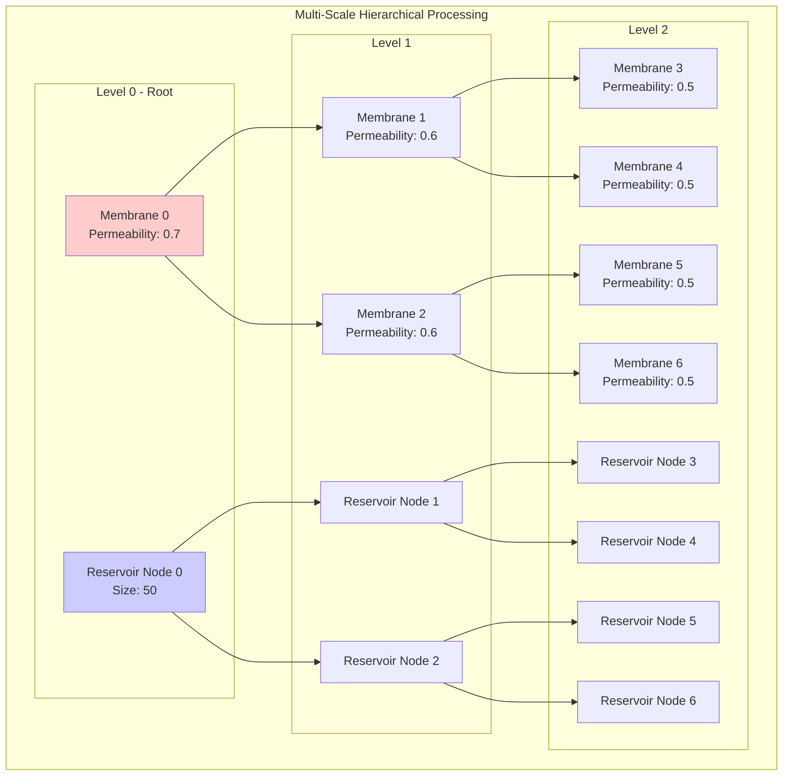

---

## 2. Component Architecture Details

### 2.1 Paun Membrane System Architecture

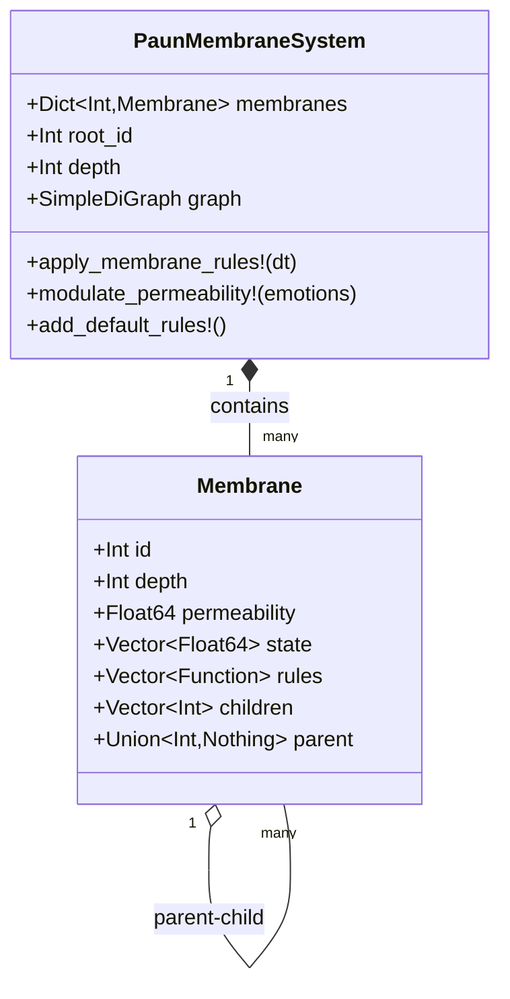

**Key Operations**:
- Information flows from leaves to root (bottom-up)
- Permeability modulated by emotional state
- Rules apply: tanh activation, normalization, sparse coding

### 2.2 Deep Tree ESN Architecture

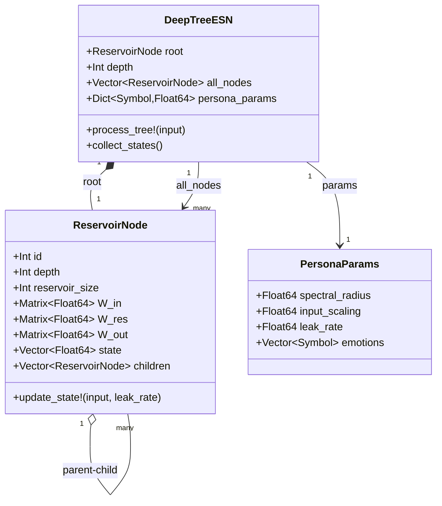

**Persona Profiles**:

| Persona | Spectral Radius | Input Scaling | Leak Rate | Cognitive Style |
|---------|----------------|---------------|-----------|-----------------|
| `contemplative_scholar` | 0.95 | 0.3 | 0.2 | Deep processing, high memory |
| `dynamic_explorer` | 0.7 | 0.8 | 0.8 | Fast adaptation, broad scanning |
| `cautious_analyst` | 0.99 | 0.2 | 0.3 | High stability, systematic |
| `creative_visionary` | 0.85 | 0.7 | 0.6 | Edge of chaos, divergent |
| `balanced` | 0.85 | 0.5 | 0.5 | Moderate across all dimensions |

### 2.3 Affective Agency Architecture

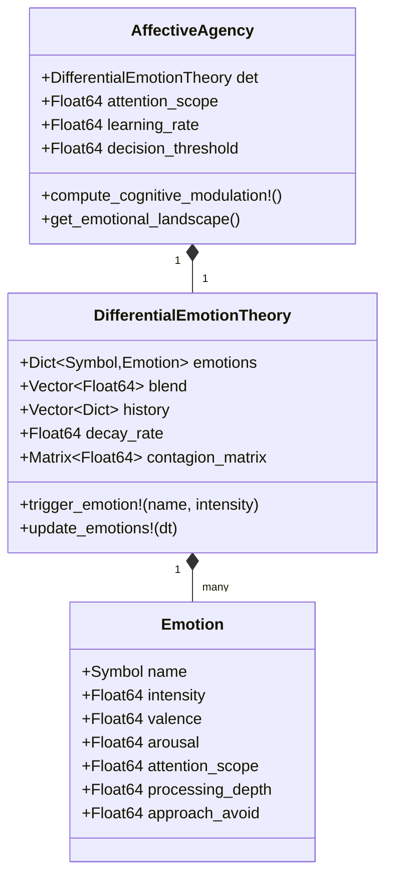

**Basic Emotions Catalog**:

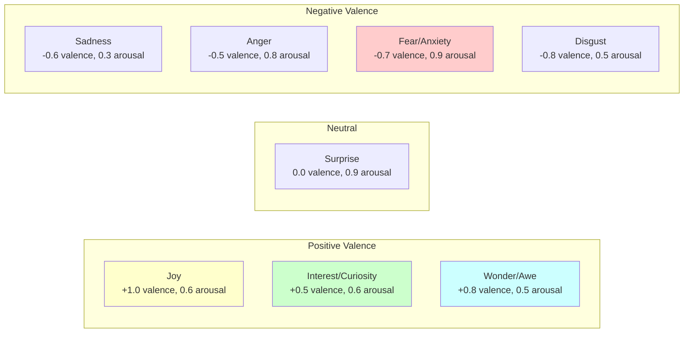

### 2.4 Temporal Integration Components

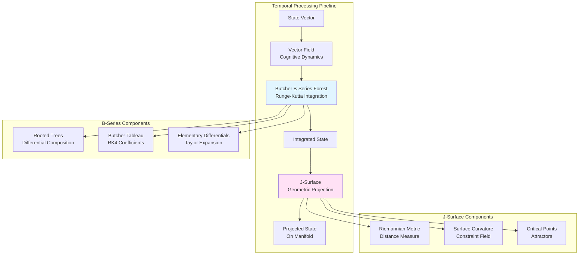

### 2.5 Transformer Integration Architecture

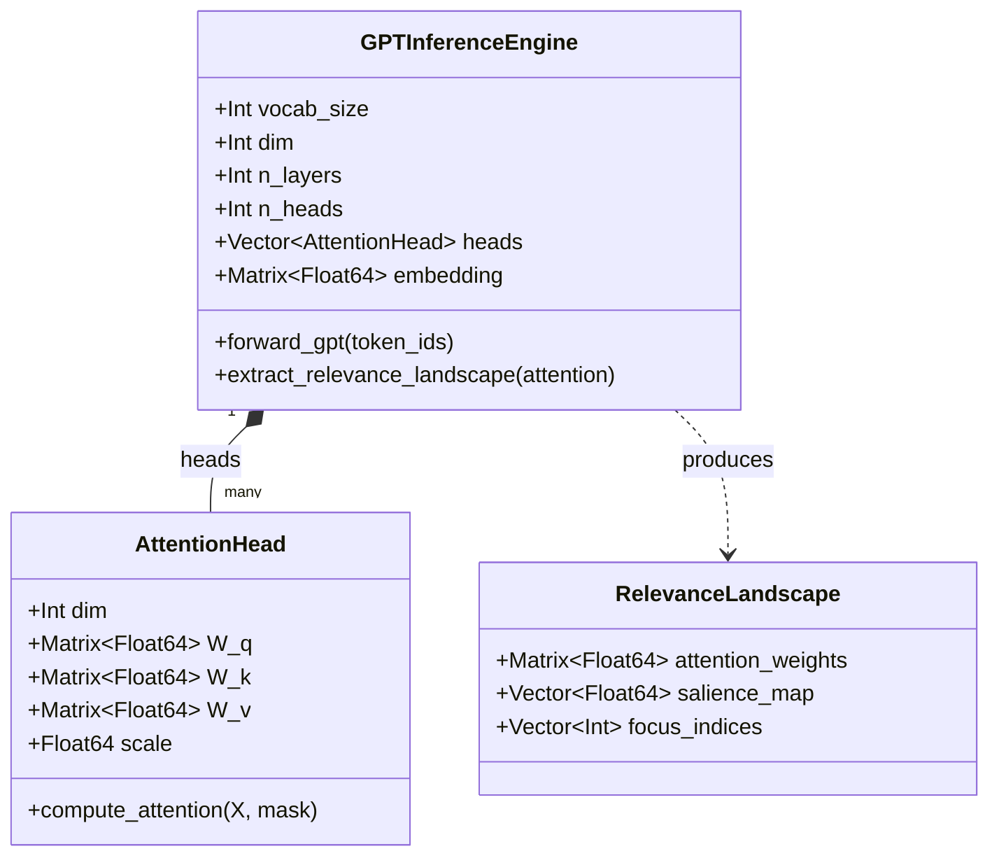

---

## 3. Data Flow and Interaction Patterns

### 3.1 Complete Processing Sequence

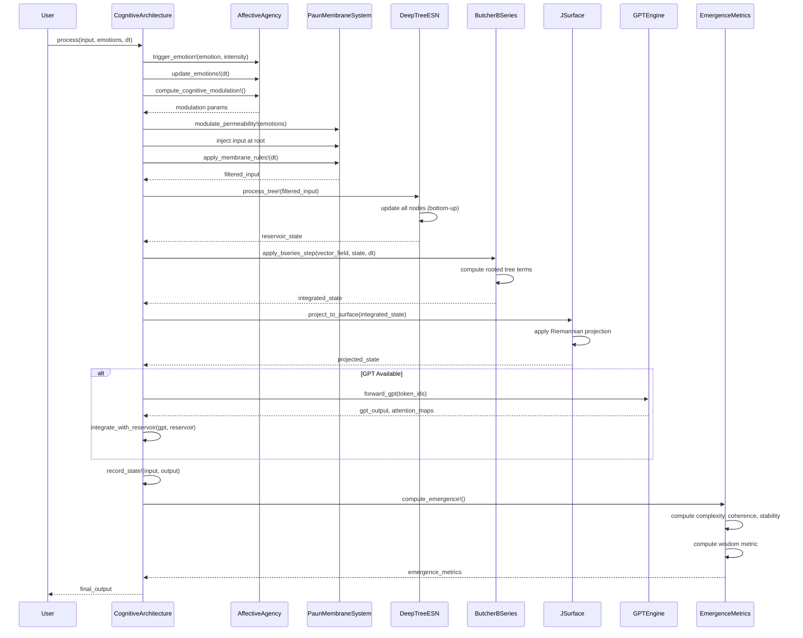

### 3.2 Emotion Modulation Flow

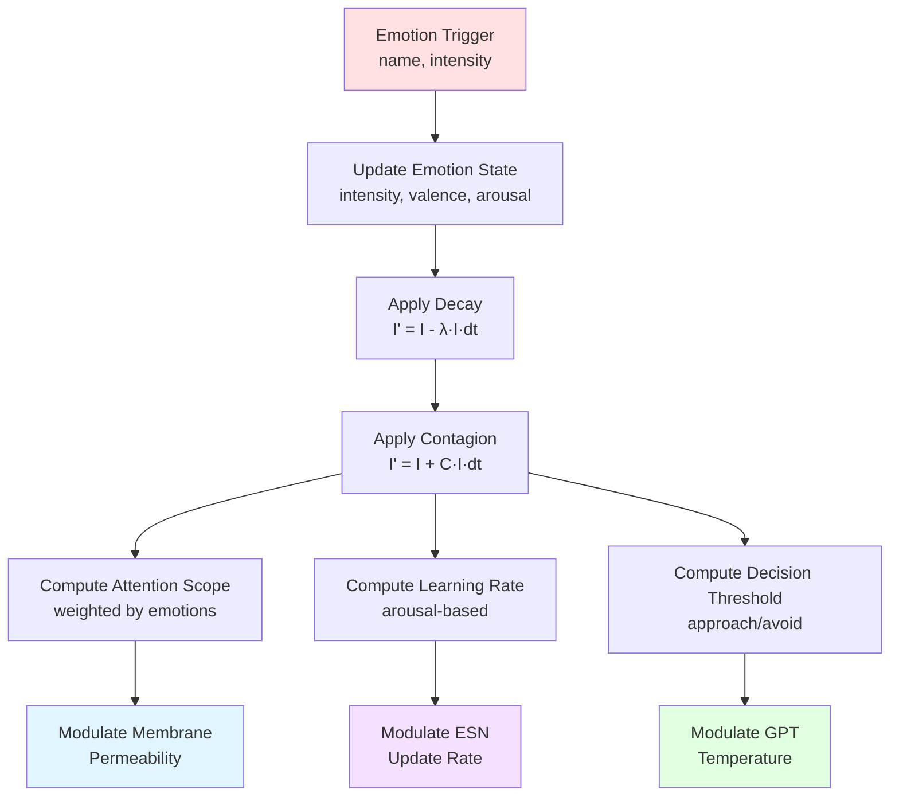

### 3.3 State Aggregation Pattern

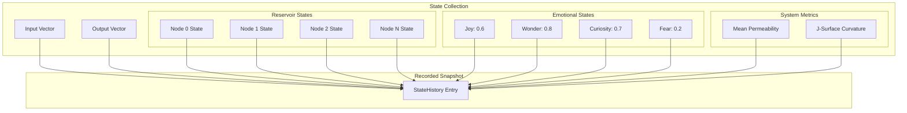

---

## 4. Emergence Metrics Computation

### 4.1 Wisdom Calculation Pipeline

```mermaid
flowchart TB
    History[State History<br/>Last N Snapshots] --> Extract[Extract Time Series]
    
    Extract --> Complexity[Compute Complexity<br/>H = 0.5·log det(Cov(S))]
    Extract --> Coherence[Compute Coherence<br/>mean(cor(subsystems))]
    Extract --> Stability[Compute Stability<br/>1/(1 + var(trajectory))]
    Extract --> Adaptability[Compute Adaptability<br/>cor(Δinput, Δoutput)]
    
    Complexity --> Wisdom[Compute Wisdom<br/>(coherence + stability +<br/>0.5·complexity +<br/>0.5·adaptability) / 3]
    Coherence --> Wisdom
    Stability --> Wisdom
    Adaptability --> Wisdom
    
    Wisdom --> Metrics[Emergence Metrics<br/>Dictionary]
    
    style Wisdom fill:#e1ffe1,stroke:#333,stroke-width:3px
```

### 4.2 Metric Interpretation

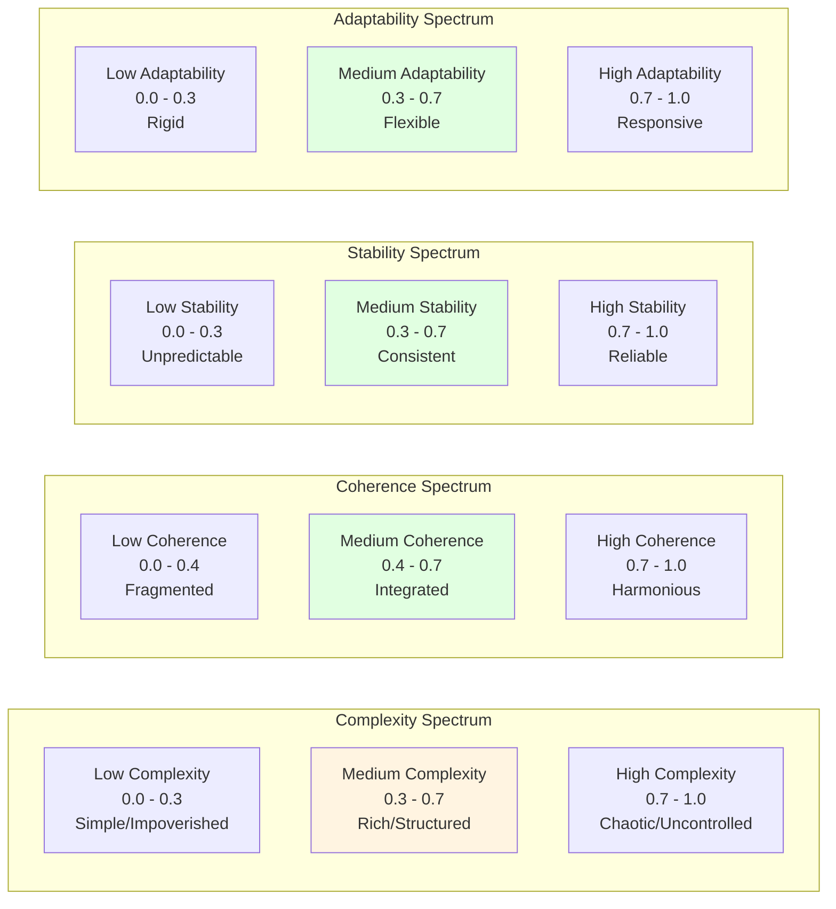

---

## 5. Integration Boundaries and External Systems

### 5.1 Python Integration via PyCall

```mermaid
graph TB
    subgraph "Julia Environment"
        JCode[Julia Code<br/>DeepTreeEchoSelf]
        PyCall[PyCall.jl<br/>Bridge Layer]
    end
    
    subgraph "Python Environment"
        RPy[ReservoirPy<br/>Practical Reservoir Computing]
        NumPy[NumPy<br/>Numerical Operations]
        TF[TensorFlow/PyTorch<br/>(Optional)]
    end
    
    JCode <-->|Julia↔Python| PyCall
    PyCall <-->|Function Calls| RPy
    PyCall <-->|Array Transfer| NumPy
    PyCall <-->|ML Models| TF
    
    style PyCall fill:#ffe1f5
```

### 5.2 External Dependencies and Contracts

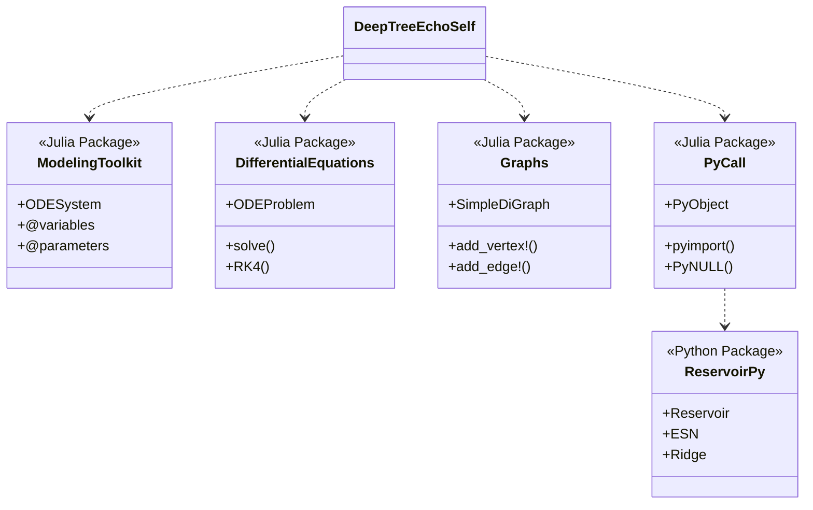

---

## 6. Persona System Architecture

### 6.1 Persona Parameter Cascade

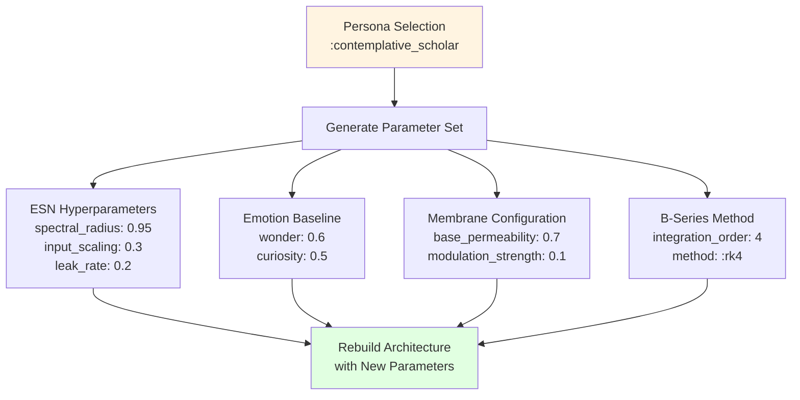

### 6.2 Persona Comparison Matrix

```mermaid
graph TB
    subgraph Personas
        direction TB
        CS[Contemplative Scholar<br/>High Memory | Deep Processing]
        DE[Dynamic Explorer<br/>Fast Adaptation | Broad Scanning]
        CA[Cautious Analyst<br/>High Stability | Systematic]
        CV[Creative Visionary<br/>Edge of Chaos | Divergent]
        BA[Balanced<br/>Moderate All Dimensions]
    end
    
    CS -.different cognitive style.-> DE
    DE -.different cognitive style.-> CA
    CA -.different cognitive style.-> CV
    CV -.different cognitive style.-> BA
    
    style CS fill:#cce5ff
    style DE fill:#ffffcc
    style CA fill:#e5ccff
    style CV fill:#ffcccc
    style BA fill:#ccffcc
```

---

## 7. System Boundaries and Invariants

### 7.1 System Constraints

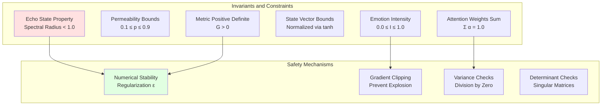

### 7.2 Error Handling and Robustness

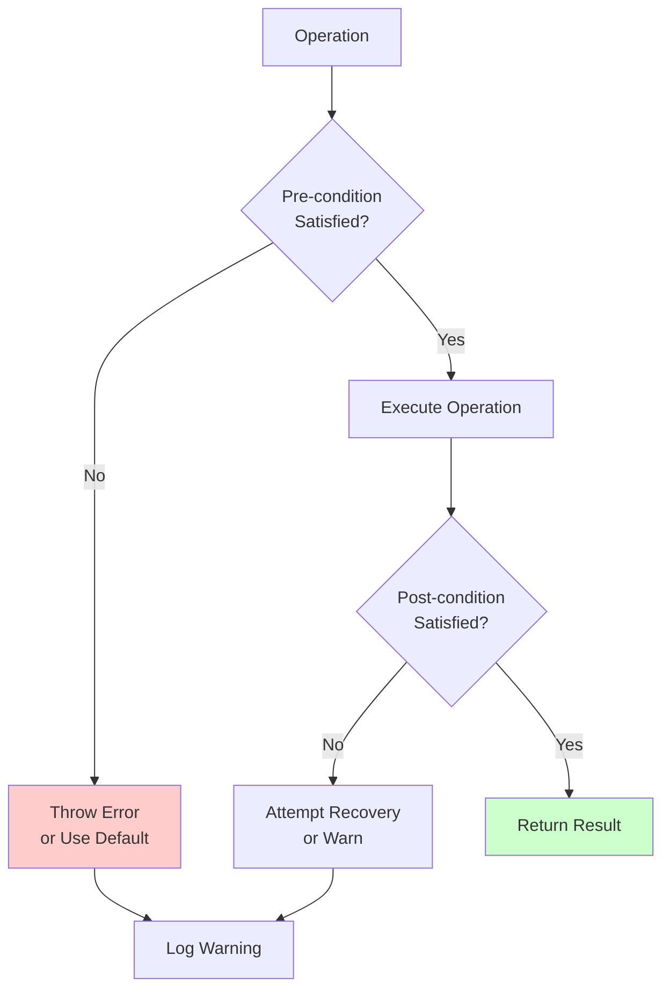

---

## 8. Performance Characteristics

### 8.1 Computational Complexity

| Operation | Complexity | Notes |
|-----------|------------|-------|
| Membrane Processing | O(N·D) | N nodes, D dimensions |
| Reservoir Update | O(N·R²) | N nodes, R reservoir size |
| B-Series Integration | O(D·T) | D dimensions, T tree terms |
| J-Surface Projection | O(D²) | Matrix operations |
| GPT Attention | O(L²·D) | L sequence length, D dimensions |
| Emergence Metrics | O(H·D) | H history length, D dimensions |

### 8.2 Memory Footprint

```mermaid
pie title Memory Distribution (Approximate)
    "Reservoir States" : 40
    "Membrane States" : 20
    "State History" : 25
    "Weight Matrices" : 10
    "Metadata" : 5
```

---

## 9. Usage Patterns and Examples

### 9.1 Basic Usage Flow

```mermaid
sequenceDiagram
    participant User
    participant Arch as CognitiveArchitecture
    participant Process
    participant Analysis
    
    User->>Arch: new(persona=:contemplative_scholar)
    Arch-->>User: architecture instance
    
    loop Processing Loop
        User->>Process: process(arch, input, emotions)
        Process->>Process: membrane → ESN → B-series → J-surface
        Process-->>User: output
    end
    
    User->>Analysis: analyze_emergence(arch)
    Analysis->>Analysis: compute metrics
    Analysis-->>User: report with wisdom, recommendations
```

### 9.2 Extension Points

```mermaid
graph TB
    subgraph "Extensibility"
        E1[Custom Personas<br/>Define new parameter sets]
        E2[Custom Emotions<br/>Add new basic emotions]
        E3[Custom Integration<br/>Implement new Butcher methods]
        E4[Custom Attention<br/>Explore attention variants]
        E5[Custom Learning<br/>Add online adaptation]
        E6[Custom Metrics<br/>Define new emergence measures]
    end
    
    E1 -->|PersonaParams| Core[Core Architecture]
    E2 -->|EmotionDef| Core
    E3 -->|ButcherTableau| Core
    E4 -->|AttentionHead| Core
    E5 -->|LearningAlgo| Core
    E6 -->|MetricFunction| Core
    
    style Core fill:#e1f5ff,stroke:#333,stroke-width:3px
```

---

## 10. Future Architecture Evolution

### 10.1 Planned Integrations

```mermaid
graph TB
    Current[Current Architecture<br/>v0.1.0]
    
    subgraph "Near-term Enhancements"
        OC[OpenCog AtomSpace<br/>Symbolic Reasoning]
        RP[ReservoirPy Full Integration<br/>Optimized Reservoirs]
        OL[Online Learning<br/>FORCE, RLS]
    end
    
    subgraph "Long-term Vision"
        MA[Multi-Agent Systems<br/>Collective Intelligence]
        DL[Distributed Learning<br/>Federated Architecture]
        NI[Neuromorphic Implementation<br/>Hardware Acceleration]
    end
    
    Current --> OC
    Current --> RP
    Current --> OL
    
    OC --> MA
    RP --> DL
    OL --> MA
    
    MA --> NI
    DL --> NI
```

---

## 11. References and Theoretical Foundations

### 11.1 Conceptual Framework

```mermaid
mindmap
    root((Deep Tree<br/>Echo Self))
        Vervaeke Cognitive Science
            4E Cognition
                Embodied
                Embedded
                Enacted
                Extended
            Four Ways of Knowing
                Propositional
                Procedural
                Perspectival
                Participatory
            Relevance Realization
                Filtering
                Framing
                Feed-forward
                Feedback
        Computational Paradigms
            Reservoir Computing
                Echo State Networks
                Liquid State Machines
            Membrane Computing
                P-Systems
                Hierarchical Boundaries
            Differential Geometry
                Riemannian Manifolds
                Geodesics
            Numerical Integration
                Butcher Series
                Rooted Trees
        Affective Science
            Differential Emotion Theory
                Discrete Emotions
                Neural Substrates
            Affective Neuroscience
                Emotion-Cognition Integration
                Participatory Knowing
```

---

## Conclusion

The Deep Tree Echo Self represents a comprehensive integration of multiple computational and cognitive paradigms into a unified architecture for wisdom cultivation. The system demonstrates how emergent intelligence can arise from the interaction of hierarchical structures (membranes, trees), temporal dynamics (B-series, reservoirs), affective modulation (emotions), and relevance computation (attention).

**Key Innovation**: The architecture treats the "self" not as a fixed entity but as an emergent process arising from recursive relevance realization optimization across all subsystems simultaneously.

**Philosophical Grounding**: Based on John Vervaeke's cognitive science framework, the system embodies 4E cognition and integrates four ways of knowing into a single computational framework.

**Practical Application**: Enables computational exploration of wisdom cultivation, cognitive styles (personas), and the systematic optimization of relevance realization.

---

**Document Version**: 1.0  
**Last Updated**: 2025-01-06  
**Architecture Version**: v0.1.0
